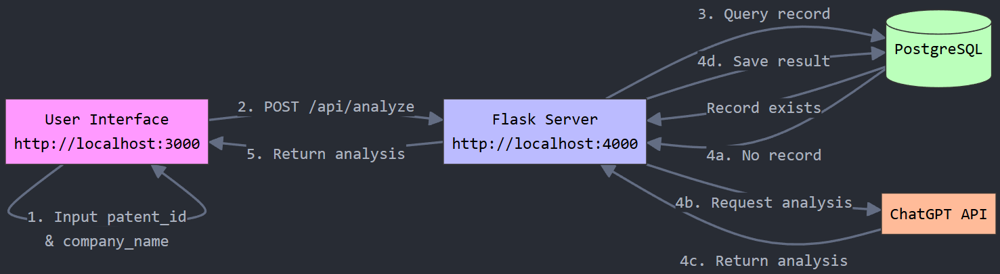

# Patent Analysis System

A system for analyzing patent infringement using AI technology, built with Flask, Next.js, PostgreSQL, and Docker.

## System Architecture
- Frontend: Next.js (Port 3000)
- Backend: Flask (Port 4000)
- Database: PostgreSQL
- Container: Docker
- AI Integration: ChatGPT API

## System Flow


## Prerequisites
- Docker and Docker Compose
- OpenAI API Key (for ChatGPT integration)

## Installation

1. Clone the repository
```bash
unzip patent.zip
```
OR
```
git clone https://github.com/shypeter/patent.git
cd patent
cp ~/company_products.json backend
cp ~/patents.json backend
```
2. Environment Setup
```bash
cp .env.example .env
# edit OPENAI_API_KEY with your api key
```
3. Build and Start Docker Containers
```
docker-compose build
docker-compose up -d
```
4. Initialize Database
```
docker exec -it flaskapp python import_data.py
```

## API Documentation
API documentation is available in OpenAPI (Swagger) format:
```
patent/swagger.yaml
```
To view the API documentation

    1. Visit Swagger Editor

    2. Import the swagger.yaml file

# Database Schema
## Patents Table

Stores patent information and related metadata.

| Column Name | Data Type | Constraints |
|------------|-----------|-------------|
| id | Integer | Primary Key |
| publication_number | String(50) | Unique, Not Null |
| title | String(500) | Not Null |
| abstract | Text | - |
| description | Text | - |
| assignee | String(200) | - |
| inventors | JSONB | - |
| priority_date | Date | - |
| application_date | Date | - |
| grant_date | Date | - |
| claims | JSONB | - |
| jurisdictions | String(50) | - |
| classifications | JSONB | - |
| created_at | DateTime | Default: now() |
| updated_at | DateTime | Default: now(), Auto-update |

## Companies Table

Stores company information and their products.

| Column Name | Data Type | Constraints |
|------------|-----------|-------------|
| id | Integer | Primary Key |
| name | String(200) | Unique, Not Null, Indexed |
| products | JSONB | - |
| created_at | DateTime | Default: now() |
| updated_at | DateTime | Default: now(), Auto-update |

## Reports Table

Stores patent infringement analysis reports.

| Column Name | Data Type | Constraints |
|------------|-----------|-------------|
| id | Integer | Primary Key |
| patent_publication_number | String(50) | Not Null, Indexed |
| company_name | String(200) | Not Null, Indexed |
| analysis_data | JSONB | - |
| created_at | DateTime | Default: now() |

### Indexes

The Reports table includes the following indexes:
- Combined unique index on `patent_publication_number` and `company_name` (named: idx_patent_company_unique)
- Individual indexes on `patent_publication_number` and `company_name`

# Features
- Patent infringement analysis using AI
- Caching of analysis results
- RESTful API endpoints
- Responsive web interface